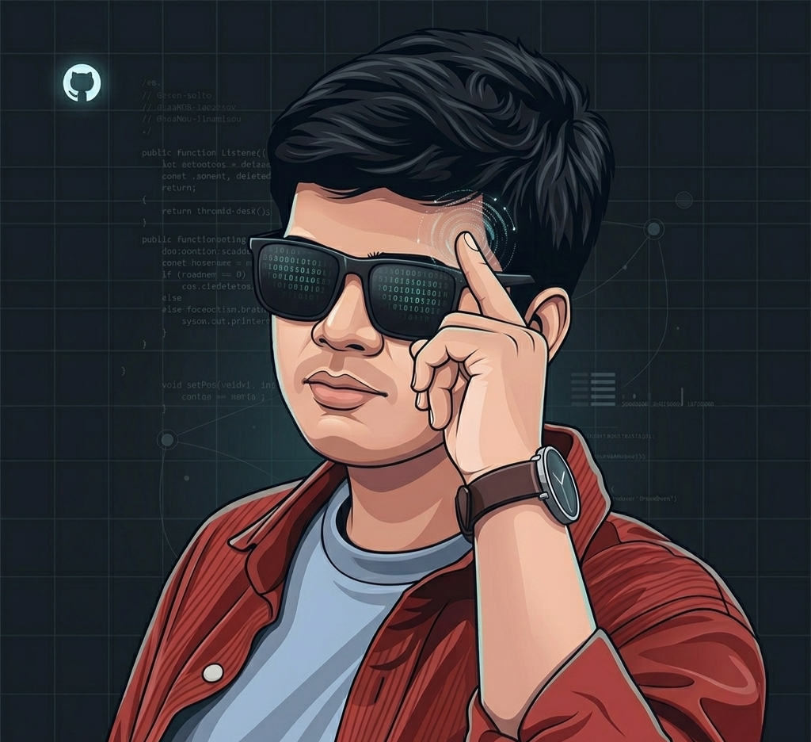

  

    

    

      
AA

      

        
Ashton Alex Mascarenhas

        
@ashton0803

        
SY AIML Student — building at the intersection of ML, MLOps & Agentic AI

        

          ML
          MLOps
          AI Agents
          Python
        

      

    

  

  

    

      

Current focus

      

        
<i class="ti ti-cpu" style="color:#2dd4bf" aria-hidden="true"></i>Machine learning

        
<i class="ti ti-route" style="color:#a78bfa" aria-hidden="true"></i>MLOps pipelines

        
<i class="ti ti-robot" style="color:#f472b6" aria-hidden="true"></i>Agentic AI

        
<i class="ti ti-chart-dots" style="color:#fbbf24" aria-hidden="true"></i>Data analysis

      

    

    

      

        

Technical skills

        

          <i class="ti ti-brand-python" style="color:#a78bfa" aria-hidden="true"></i>
          Python
          

        

        

          <i class="ti ti-chart-bar" style="color:#f472b6" aria-hidden="true"></i>
          Data analysis
          

        

        

          <i class="ti ti-brain" style="color:#fbbf24" aria-hidden="true"></i>
          ML models
          

        

        

          <i class="ti ti-settings-automation" style="color:#2dd4bf" aria-hidden="true"></i>
          MLOps
          

        

      

      

        

Beyond the code

        

          

            <i class="ti ti-piano ic-pink" aria-hidden="true"></i>
          

          

            
Keyboardist

            
Chord theory & composition

          

        

        

          

            <i class="ti ti-music ic-amber" aria-hidden="true"></i>
          

          

            
Music production

            
Digital audio & sound design

          

        

      

    

    

      

        

Connect

        
Ashton Alex Mascarenhas

        
linkedin.com/in/ashton0803

      

      <a href="https://www.linkedin.com/in/ashton0803/" class="linkedin-btn" target="_blank">
        <i class="ti ti-brand-linkedin" aria-hidden="true"></i>
        View profile
      </a>
    

  

  

    ~/ashton0803 $
    git push origin main
    
  

